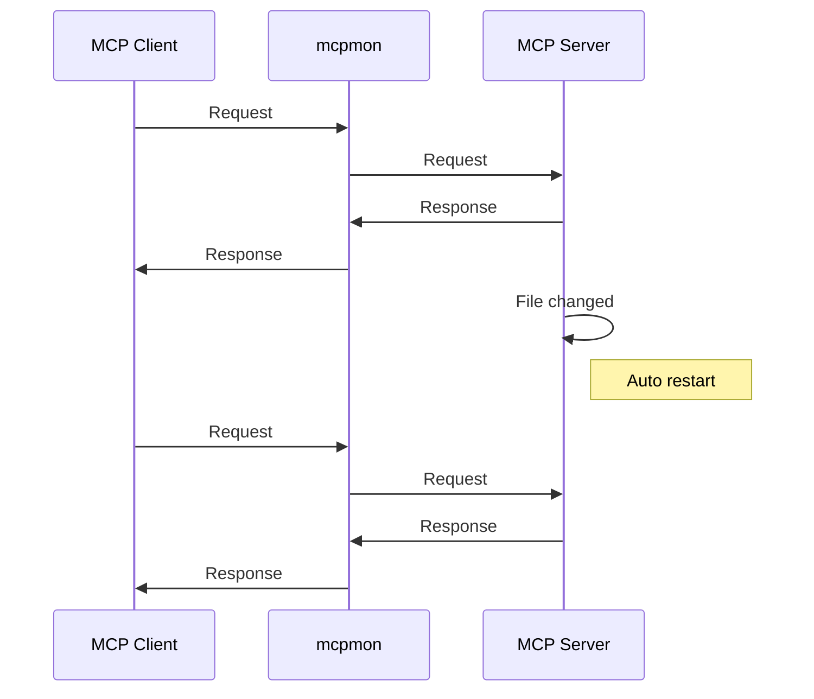

# mcpmon

[](https://nodejs.org/)
[](https://opensource.org/licenses/MIT)
[](./tests/)
[](https://prettier.io/)

**Hot-reload monitor for MCP servers - like nodemon but for Model Context Protocol**

Make changes to your MCP server code and see them instantly without restarting your MCP client. Just like nodemon automatically restarts Node.js applications, mcpmon automatically restarts MCP servers.

## What it is

mcpmon is a **transparent proxy** that sits between your MCP client (Claude Code, Claude Desktop, MCP Inspector, etc.) and your MCP server. When you modify your server code, mcpmon automatically restarts the server while keeping your client connected.

**Key benefits:**

- **Like nodemon, but for MCP** - Simple command-line interface you already know
- **Zero configuration** - Just wrap your server command with mcpmon
- **Non-disruptive development** - Your MCP client stays connected while your server reloads
- **Zero message loss** - Requests are buffered during server restart
- **Universal compatibility** - Works with any MCP server (Node.js, Python, Deno, etc.)
- **Library support** - Import as a dependency for custom monitoring solutions

## Quick Start

1. **Install globally**:
   ```bash
   npm install -g mcpmon
   ```

2. **Use with your MCP server**:
   ```bash
   # Instead of: node server.js
   mcpmon node server.js

   # Instead of: python server.py  
   mcpmon python server.py

   # Instead of: deno run --allow-all server.ts
   mcpmon deno run --allow-all server.ts
   ```

3. **Use with MCP clients**:
   ```bash
   # MCP Inspector
   npx @modelcontextprotocol/inspector mcpmon node server.js

   # For existing Claude Code/Desktop servers, use setup:
   mcpmon setup my-server
   ```

   Setup automatically configures your existing MCP servers for hot-reload! ✨

That's it! Your MCP server now has hot-reload enabled. Edit your server code and changes apply instantly.

## Enhanced Command-Line Interface

mcpmon provides a powerful command-line interface with auto-detection capabilities, extensive configuration options, and environment variable support for seamless MCP development.

### Auto-Detection Features

mcpmon automatically detects and configures optimal settings for your development environment:

```bash
# Auto-detects files to watch from command arguments
mcpmon node server.js                    # Watches: server.js
mcpmon python app.py --config config.json # Watches: app.py, config.json
mcpmon deno run --allow-all main.ts       # Watches: main.ts

# Auto-detects Node.js version for compatibility (setup command)
mcpmon setup my-server                    # Uses latest compatible Node.js

# Auto-detects project structure and dependencies
mcpmon npm start                          # Watches: package.json, package-lock.json
mcpmon yarn dev                           # Watches: package.json, yarn.lock
```

### Command-Line Options

#### Core Options
```bash
# Enable verbose logging
mcpmon --verbose node server.js
mcpmon -v python server.py

# Set custom restart delay (milliseconds)
mcpmon --delay 2000 node server.js
mcpmon -d 500 python server.py

# Override watch targets
mcpmon --watch "src/,config/" node server.js
mcpmon -w "*.py,*.json" python server.py

# Show version information
mcpmon --version
mcpmon -V

# Display help
mcpmon --help
mcpmon -h
```

#### Extension Management
```bash
# List available extensions
mcpmon --list-extensions

# Enable specific extensions
mcpmon --enable-extension large-response-handler node server.js
mcpmon --enable-extension request-logger --enable-extension metrics python server.py

# Disable extensions
mcpmon --disable-extension large-response-handler node server.js

# Configure extension data directory
mcpmon --extensions-data-dir ./session-data node server.js

# Pass JSON configuration to extensions
mcpmon --extension-config '{"threshold":25000,"format":"parquet"}' node server.js
```

#### Docker Integration
```bash
# Container cleanup and management
mcpmon --cleanup                          # Interactive cleanup of orphaned containers
mcpmon --cleanup --force                  # Force cleanup without confirmation
mcpmon --cleanup --verbose                # Detailed cleanup logging

# Docker command passthrough with auto-labeling
mcpmon docker run -d my-server:latest     # Auto-adds session tracking labels
mcpmon docker compose up my-service       # Manages compose services with hot-reload
```

#### Setup and Configuration
```bash
# Server setup and management
mcpmon setup my-server                    # Setup hot-reload for existing server
mcpmon setup --all                        # Setup all stdio servers
mcpmon setup --list                       # List available servers
mcpmon setup --restore                    # Restore original configurations

# Development mode options
mcpmon --dry-run node server.js           # Preview actions without execution
mcpmon --no-auto-restart node server.js   # Disable automatic restarts
```

### Environment Variable Configuration

mcpmon supports comprehensive environment variable configuration for fine-tuned control:

#### Core Behavior Variables
```bash
# File watching configuration
MCPMON_WATCH="src/,config/,*.json"        # Override auto-detected watch targets
MCPMON_IGNORE="node_modules/,dist/"       # Ignore specific patterns
MCPMON_EXTENSIONS=".js,.ts,.py,.json"     # File extensions to monitor

# Timing and performance
MCPMON_DELAY=1000                         # Restart delay in milliseconds
MCPMON_DEBOUNCE=250                       # File change debounce time
MCPMON_TIMEOUT=30000                      # Server startup timeout

# Logging and debugging
MCPMON_VERBOSE=true                       # Enable verbose logging
MCPMON_LOG_LEVEL=debug                    # Set log level (error, warn, info, debug)
MCPMON_LOG_FILE="./mcpmon.log"            # Log to file

# Extension system
MCPMON_EXTENSIONS_DIR="./mcpmon-data"     # Extension data directory
MCPMON_EXTENSIONS_ENABLED="ext1,ext2"     # Comma-separated list of enabled extensions
MCPMON_EXTENSIONS_DISABLED="ext3"         # Comma-separated list of disabled extensions
```

#### MCP Protocol Variables
```bash
# Response handling
MAX_MCP_OUTPUT_TOKENS=6250                # Large response threshold (≈25KB)
MCPMON_BUFFER_SIZE=1048576               # Message buffer size in bytes
MCPMON_MAX_RETRIES=3                     # Maximum retry attempts

# Connection management
MCPMON_CONNECT_TIMEOUT=5000              # Initial connection timeout
MCPMON_KEEPALIVE_INTERVAL=30000          # Keep-alive ping interval
MCPMON_GRACEFUL_SHUTDOWN=10000           # Graceful shutdown timeout
```

#### Docker-Specific Variables
```bash
# Container management
MCPMON_DOCKER_CLEANUP=true               # Auto-cleanup orphaned containers
MCPMON_DOCKER_TIMEOUT=30000              # Container operation timeout
MCPMON_DOCKER_LABELS="custom=value"      # Additional container labels

# Session management
MCPMON_SESSION_ID="custom-session"       # Override auto-generated session ID
MCPMON_SESSION_PERSIST=true              # Persist session data across restarts
```

## Configuration

mcpmon provides multiple configuration methods to customize behavior for your specific development workflow. Configuration can be applied through environment variables, command-line options, configuration files, and runtime parameters.

### Environment Variable Configuration

mcpmon supports comprehensive environment variable configuration for fine-grained control over all aspects of operation:

#### Core Behavior Variables
```bash
# File watching configuration
MCPMON_WATCH="src/,config/,*.json"        # Override auto-detected watch targets
MCPMON_IGNORE="node_modules/,dist/"       # Ignore specific patterns
MCPMON_EXTENSIONS=".js,.ts,.py,.json"     # File extensions to monitor

# Timing and performance
MCPMON_DELAY=1000                         # Restart delay in milliseconds
MCPMON_DEBOUNCE=250                       # File change debounce time
MCPMON_TIMEOUT=30000                      # Server startup timeout

# Logging and debugging
MCPMON_VERBOSE=true                       # Enable verbose logging
MCPMON_LOG_LEVEL=debug                    # Set log level (error, warn, info, debug)
MCPMON_LOG_FILE="./mcpmon.log"            # Log to file
```

#### Extension System Variables
```bash
# Extension management
MCPMON_EXTENSIONS_DIR="./mcpmon-data"     # Extension data directory
MCPMON_EXTENSIONS_ENABLED="ext1,ext2"     # Comma-separated list of enabled extensions
MCPMON_EXTENSIONS_DISABLED="ext3"         # Comma-separated list of disabled extensions

# MCP protocol configuration
MAX_MCP_OUTPUT_TOKENS=6250                # Large response threshold (≈25KB)
MCPMON_BUFFER_SIZE=1048576               # Message buffer size in bytes
MCPMON_MAX_RETRIES=3                     # Maximum retry attempts
```

### watchTargets Array Configuration

The `watchTargets` array system provides flexible file monitoring beyond simple file paths. You can configure watch targets through multiple methods:

#### Environment Variable Usage
```bash
# Basic file and directory watching
MCPMON_WATCH="server.js,config.json,src/"

# Pattern-based watching
MCPMON_WATCH="*.py,requirements.txt,config/"

# Mixed patterns with exclusions
MCPMON_WATCH="src/,config/" MCPMON_IGNORE="*.test.js,node_modules/"

# Auto-detection with manual additions
MCPMON_WATCH="auto,custom-dir/,settings.yaml"
```

#### Command-Line Override
```bash
# Override auto-detected watch targets
mcpmon --watch "src/,config/" node server.js
mcpmon -w "*.py,*.json" python server.py

# Combine with ignore patterns
mcpmon --watch "src/" --ignore "*.test.*,dist/" node server.js
```

#### Programmatic Configuration
```typescript
import { createMCPProxy } from 'mcpmon';

const proxy = await createMCPProxy({
  command: 'node',
  args: ['server.js'],
  watchTargets: [
    'server.js',           // Direct file
    'config/',             // Directory
    '*.json',              // Pattern
    { pattern: 'src/**/*.ts', ignore: ['*.test.ts'] }  // Advanced pattern
  ]
});
```

### Configuration File Options

mcpmon supports configuration files for persistent, project-specific settings:

#### mcpmon.config.js
```javascript
// mcpmon.config.js
module.exports = {
  // Core configuration
  restartDelay: 1000,
  verbose: process.env.NODE_ENV === 'development',
  
  // Watch configuration
  watchTargets: [
    'src/',
    'config/',
    '*.json',
    { pattern: '**/*.py', ignore: ['**/__pycache__/**'] }
  ],
  
  // Extension configuration
  extensions: {
    enabled: ['large-response-handler', 'request-logger'],
    dataDir: './mcpmon-data',
    config: {
      threshold: 25000,
      logLevel: 'info'
    }
  },
  
  // Environment-specific overrides
  environments: {
    development: {
      verbose: true,
      restartDelay: 500
    },
    production: {
      logFile: '/var/log/mcpmon/server.log',
      extensions: {
        enabled: ['metrics', 'large-response-handler']
      }
    }
  }
};
```

#### package.json Configuration
```json
{
  "name": "my-mcp-server",
  "mcpmon": {
    "watchTargets": ["src/", "config.json"],
    "restartDelay": 1000,
    "extensions": {
      "enabled": ["large-response-handler"],
      "config": {
        "threshold": 20000
      }
    }
  }
}
```

### Runtime Configuration Examples

#### Development Workflow
```bash
# Full-featured development setup
MCPMON_VERBOSE=true \
MCPMON_EXTENSIONS_DIR=./dev-data \
mcpmon --enable-extension large-response-handler \
       --enable-extension request-logger \
       --extension-config '{"logLevel":"debug","threshold":15000}' \
       node server.js

# Python development with custom watch patterns
MCPMON_WATCH="*.py,requirements.txt,config/" \
MCPMON_DELAY=500 \
mcpmon --verbose python -m my_mcp_server

# TypeScript development with auto-detection
mcpmon --watch "src/,tsconfig.json" \
       --extension-config '{"threshold":30000}' \
       npm run dev
```

#### Production Configuration
```bash
# Production monitoring setup
MCPMON_LOG_FILE="/var/log/mcpmon/server.log" \
MCPMON_EXTENSIONS_DIR="/var/lib/mcpmon" \
MCPMON_WATCH="src/,config/production.json" \
mcpmon --enable-extension metrics \
       --enable-extension large-response-handler \
       --extension-config '{"metricsPort":9090,"threshold":50000}' \
       node production-server.js

# High-performance configuration
MCPMON_DELAY=100 \
MCPMON_DEBOUNCE=50 \
MCPMON_BUFFER_SIZE=2097152 \
MAX_MCP_OUTPUT_TOKENS=12500 \
mcpmon --watch "src/,package.json" \
       --no-auto-restart \
       node server.js
```

#### Docker Integration
```bash
# Docker development with comprehensive configuration
MCPMON_VERBOSE=true \
MCPMON_DOCKER_CLEANUP=true \
MCPMON_WATCH="./src,./config" \
mcpmon --enable-extension large-response-handler \
       docker run -d \
       -e NODE_ENV=development \
       -e API_KEY=secret \
       -v $(pwd)/src:/app/src \
       my-server:latest

# Docker Compose with environment integration
MCPMON_WATCH="./src,./config,docker-compose.yml" \
MCPMON_EXTENSIONS_DIR="./docker-data" \
mcpmon docker compose up my-service
```

### Advanced Auto-Detection

mcpmon's enhanced auto-detection provides intelligent defaults based on your project structure:

```bash
# Package.json detection
mcpmon npm start                          # Auto-watches: package.json, package-lock.json, src/
mcpmon yarn dev                           # Auto-watches: package.json, yarn.lock, src/

# Framework detection
mcpmon next dev                           # Auto-watches: Next.js specific files
mcpmon vite build                         # Auto-watches: Vite configuration files

# Language-specific detection
mcpmon python -m uvicorn app:main        # Auto-watches: *.py, requirements.txt
mcpmon cargo run                          # Auto-watches: Cargo.toml, src/
mcpmon go run main.go                     # Auto-watches: *.go, go.mod
```

### Integration with MCP Tools

#### MCP Inspector Integration
```bash
# Basic inspector usage
npx @modelcontextprotocol/inspector mcpmon node server.js

# With enhanced configuration
MCPMON_VERBOSE=true \
API_KEY=your-key \
npx @modelcontextprotocol/inspector \
mcpmon --enable-extension request-logger node server.js

# Development mode with extensions
mcpmon --enable-extension large-response-handler \
       --extension-config '{"threshold":20000}' \
       node server.js | \
npx @modelcontextprotocol/inspector
```

#### Advanced Tool Integration
```bash
# With debugging and monitoring
MCPMON_LOG_LEVEL=debug \
mcpmon --enable-extension metrics \
       --enable-extension request-logger \
       node --inspect=0.0.0.0:9229 server.js

# Performance profiling setup
MCPMON_DELAY=0 \
MAX_MCP_OUTPUT_TOKENS=50000 \
mcpmon --enable-extension large-response-handler \
       node --prof server.js
```

### With Claude Code or Claude Desktop

**Easiest way:** Use the automatic setup command for existing servers:

```bash
# Setup hot-reload for an existing server
mcpmon setup my-server

# Setup all stdio servers for hot-reload
mcpmon setup --all

# List available servers
mcpmon setup --list

# Restore original config if needed
mcpmon setup --restore
```

The setup command automatically:
- Backs up your original configuration
- Detects and uses modern Node.js versions for compatibility
- Wraps your server command with mcpmon 
- Preserves all environment variables and arguments
- Enables hot-reload instantly
- Safe to run multiple times

### 🔥 Claude Desktop Hot-Reload Tips

After setting up hot-reload:

- **Code changes**: Your server automatically restarts - no action needed!
- **Schema changes** (new tools/resources): Toggle the MCP server off/on in Claude Desktop settings
  - Go to Claude Desktop Settings → Features → Model Context Protocol
  - Toggle your server off, then back on
  - **No restart needed** - just the toggle!
- **Config changes**: Restart Claude Desktop only if you modify the configuration file directly

> **Pro tip**: For the best development experience, make code changes first, then schema changes. Claude Desktop will pick up tool calls from the latest hot-reloaded code even after schema updates!

**Manual configuration:** You can also manually update your config:

**Claude Code** (`~/.claude_code_config`):
```json
{
  "mcpServers": {
    "my-server": {
      "command": "mcpmon",
      "args": ["node", "server.js"],
      "env": {
        "API_KEY": "your-key"
      }
    }
  }
}
```

**Claude Desktop** (`~/Library/Application Support/Claude/claude_desktop_config.json`):
```json
{
  "mcpServers": {
    "my-server": {
      "command": "/Users/username/.nvm/versions/node/v22.15.0/bin/node",
      "args": ["/usr/local/bin/mcpmon", "python", "server.py"],
      "env": {
        "PYTHONPATH": "/path/to/your/modules"
      }
    }
  }
}
```

> **Note**: The setup command automatically detects your latest Node.js version and mcpmon path. The above shows what the generated config looks like - you rarely need to write this manually!

## Zero-Configuration Design

mcpmon is designed for **zero configuration** while providing extensive customization options when needed. It automatically detects optimal settings based on your command and project structure.

### Intelligent Auto-Detection

mcpmon automatically configures itself by analyzing:

- **Command arguments**: Extracts file paths and dependencies from your server command
- **Project structure**: Detects framework-specific files and configurations  
- **File extensions**: Monitors relevant file types based on detected language/framework
- **Environment**: Adapts behavior for development vs production contexts

```bash
# Auto-detection examples
mcpmon node server.js                     # Watches: server.js (auto-detected)
mcpmon python app.py --config config.json # Watches: app.py, config.json (from args)
mcpmon npm start                          # Watches: package.json, src/ (npm context)
```

### Manual Configuration Override

When auto-detection isn't sufficient, you can override with environment variables:

```bash
# Override watch targets
MCPMON_WATCH="src/,config/,*.env" mcpmon node server.js

# Combine auto-detection with manual additions
MCPMON_WATCH="auto,custom-dir/" mcpmon python server.py  # "auto" preserves detection
```

### Complete Environment Variable Reference

See the [Environment Variable Configuration](#environment-variable-configuration) section above for the comprehensive list of all available configuration options including file watching, timing, logging, extensions, MCP protocol, and Docker-specific variables.

## Extensions

mcpmon features a powerful **hook-based extension system** with **dependency injection** that enables sophisticated functionality without modifying core code. Extensions can intercept messages, add new tools, handle large responses, and integrate seamlessly with the proxy lifecycle.

### Extension System Overview

The extension system is built around two key concepts:

1. **Hook-based Architecture**: Extensions register hooks to intercept key points in the proxy lifecycle
2. **Dependency Injection**: Extensions receive platform-agnostic dependencies and services through the `ExtensionContext`

Extensions integrate with mcpmon through a standardized `Extension` interface and are managed by the `ExtensionRegistry` which handles lifecycle, configuration, and dependency resolution.

### List Available Extensions

```bash
# See all available extensions
mcpmon --list-extensions
```

### Enable/Disable Extensions

```bash
# Enable specific extension
mcpmon --enable-extension large-response-handler node server.js

# Disable specific extension  
mcpmon --disable-extension request-logger node server.js

# Enable multiple extensions
mcpmon --enable-extension ext1 --enable-extension ext2 node server.js
```

### Extension Configuration

```bash
# Set extension data directory
mcpmon --extensions-data-dir ./my-data node server.js

# Pass JSON configuration to extensions
mcpmon --extension-config '{"threshold":25000,"format":"parquet"}' node server.js

# Combine extension options
mcpmon --enable-extension large-response-handler \
       --extensions-data-dir ./data \
       --extension-config '{"threshold":10000}' \
       node server.js
```

### Built-in Extensions

**Large Response Handler** (`large-response-handler`)
- Automatically handles MCP tool responses that exceed token limits (default: 25KB or MAX_MCP_OUTPUT_TOKENS env var)
- Persists large data to disk and returns metadata instead
- Generates JSON schemas and creates queryable DuckDB databases
- Adds `mcpmon_analyze-with-duckdb` and `mcpmon_list-saved-datasets` tools
- Uses hooks for response interception and tool injection

```bash
# Enable large response handling
mcpmon --enable-extension large-response-handler node server.js

# Configure response size threshold (in bytes)
mcpmon --enable-extension large-response-handler \
       --extension-config '{"threshold":20000}' \
       node server.js
```

### Hook-based Architecture

Extensions interact with mcpmon through a comprehensive hook system. Available hooks include:

#### Message Interception Hooks
- `beforeStdinForward`: Intercept and modify requests before sending to server
- `afterStdoutReceive`: Intercept and modify responses from server

#### Lifecycle Hooks
- `beforeRestart`: Called before proxy restart
- `afterServerStart`: Called after server started
- `onShutdown`: Called during proxy shutdown

#### Tool Integration Hooks
- `getAdditionalTools`: Inject additional MCP tools
- `handleToolCall`: Handle custom tool calls

### Dependency Injection

Extensions receive dependencies through the `ExtensionContext`:

```typescript
export interface ExtensionContext {
  // Platform-agnostic dependencies
  dependencies: ProxyDependencies;
  
  // Extension-specific configuration
  config: any;
  
  // Hook registration system
  hooks: ExtensionHooks;
  
  // File system access
  dataDir: string;
  
  // Structured logging
  logger: ExtensionLogger;
  
  // Session management
  sessionId: string;
  
  // Optional notification service
  notificationService?: NotificationService;
}
```

This dependency injection pattern ensures extensions work across different platforms and environments without direct dependencies on Node.js, Deno, or other runtime-specific APIs.

### Extension Examples

```bash
# Development with large data processing
mcpmon --enable-extension large-response-handler \
       --extensions-data-dir ./session-data \
       python data_server.py

# Multiple extensions for monitoring
mcpmon --enable-extension request-logger \
       --enable-extension large-response-handler \
       --extension-config '{"logLevel":"debug","threshold":15000}' \
       node server.js

# Production monitoring
mcpmon --enable-extension metrics \
       --extensions-data-dir /var/log/mcpmon \
       --extension-config '{"metricsPort":9090}' \
       node server.js
```

### Creating Custom Extensions

Extensions implement the `Extension` interface and use hooks for integration:

```typescript
// my-extension/index.ts
export class MyExtension implements Extension {
  readonly id = 'my-extension';
  readonly name = 'My Custom Extension';
  readonly version = '1.0.0';
  readonly defaultEnabled = false;
  
  readonly configSchema = {
    type: 'object',
    properties: {
      threshold: { type: 'number', default: 1000 },
      format: { type: 'string', default: 'json' }
    }
  };
  
  async initialize(context: ExtensionContext): Promise<void> {
    // Register message interception hooks
    context.hooks.beforeStdinForward = this.interceptRequest.bind(this);
    context.hooks.afterStdoutReceive = this.interceptResponse.bind(this);
    
    // Register tool injection hooks
    context.hooks.getAdditionalTools = this.getTools.bind(this);
    context.hooks.handleToolCall = this.handleToolCall.bind(this);
    
    // Register lifecycle hooks
    context.hooks.onShutdown = this.cleanup.bind(this);
    
    // Access injected dependencies
    this.logger = context.logger;
    this.config = context.config;
    this.dataDir = context.dataDir;
  }
  
  private async interceptRequest(message: any): Promise<any | null> {
    // Modify or block request
    this.logger.debug('Intercepting request:', message);
    return message; // Return modified message or null to block
  }
  
  private async interceptResponse(message: any): Promise<any | null> {
    // Modify response
    return message;
  }
  
  private async getTools(): Promise<ToolDefinition[]> {
    // Return additional MCP tools
    return [
      {
        name: 'my-custom-tool',
        description: 'Example custom tool',
        inputSchema: {
          type: 'object',
          properties: {
            query: { type: 'string' }
          },
          required: ['query']
        }
      }
    ];
  }
  
  private async handleToolCall(toolName: string, args: any): Promise<any | null> {
    if (toolName === 'my-custom-tool') {
      // Handle custom tool call
      return { result: `Processed: ${args.query}` };
    }
    return null; // Not handled by this extension
  }
  
  private async cleanup(): Promise<void> {
    // Cleanup resources
  }
  
  async shutdown(): Promise<void> {
    // Final cleanup
  }
}

// Export as default
export default MyExtension;
```

### Extension Capabilities

Extensions can:
- **Intercept messages** before forwarding to server or after receiving responses
- **Add new MCP tools** that appear alongside server tools  
- **Handle large responses** by persisting to disk and returning metadata
- **Monitor and log** all request/response activity
- **Transform data** on the fly
- **Add authentication** or rate limiting
- **Integrate with external services** through dependency injection
- **Persist state** using the provided data directory
- **Send progress notifications** via the notification service

### Extension Registry

The `ExtensionRegistry` manages extension lifecycle:

- **Auto-loading**: Built-in extensions are loaded automatically
- **Configuration management**: Per-extension configuration and schemas
- **Dependency injection**: Provides platform-agnostic services
- **Lifecycle management**: Handles initialization and shutdown
- **Error handling**: Graceful degradation on extension failures

Extensions are initialized with full dependency injection, ensuring they work across different platforms and runtime environments while maintaining clean separation of concerns.

## Docker Container Management

mcpmon provides advanced Docker container management features that enable safe hot-reload for containerized MCP servers while preventing orphaned containers and resource leaks.

### Session-based Container Tracking

Each mcpmon instance creates a unique session ID and tracks only the Docker containers it manages:

- **Unique Session ID**: Every mcpmon instance generates a UUID-based session identifier
- **Container Isolation**: Each session only manages its own containers, preventing interference between multiple mcpmon instances
- **Safe Concurrent Usage**: Multiple mcpmon instances can run simultaneously without affecting each other's containers

### Container Labeling Scheme

mcpmon automatically injects Docker labels into `docker run` commands to track container ownership and lifecycle:

```bash
# Labels automatically added by mcpmon:
--label mcpmon.managed=true           # Identifies mcpmon-managed containers
--label mcpmon.session=<uuid>         # Unique session identifier  
--label mcpmon.pid=<pid>              # mcpmon process ID
--label mcpmon.started=<timestamp>    # Container start time
```

**Example usage:**
```bash
# Original command
mcpmon docker run -d my-mcp-server:latest

# Actual command executed (labels injected automatically)
docker run -d \
  --label mcpmon.managed=true \
  --label mcpmon.session=a1b2c3d4-e5f6-7890-abcd-ef1234567890 \
  --label mcpmon.pid=12345 \
  --label mcpmon.started=1672531200000 \
  my-mcp-server:latest
```

### Inspecting Container Labels

View mcpmon labels on running containers:

```bash
# Inspect specific container
docker inspect <container-id> | grep mcpmon

# Find all mcpmon-managed containers
docker ps --filter label=mcpmon.managed=true

# Show detailed label information
docker ps --filter label=mcpmon.managed=true --format "table {{.ID}}\t{{.Names}}\t{{.Label \"mcpmon.session\"}}\t{{.Label \"mcpmon.pid\"}}"
```

### Orphan Recovery Mechanism

mcpmon includes built-in orphan detection and cleanup to handle crashed mcpmon instances:

**Automatic Detection:**
- Containers are considered orphaned when their associated mcpmon process (PID) no longer exists
- Orphans are detected by checking if the `mcpmon.pid` label references a dead process
- Containers without PID labels are also considered orphaned

**Manual Cleanup:**
```bash
# Scan for orphaned containers and prompt for cleanup
mcpmon --cleanup

# Force cleanup without confirmation
mcpmon --cleanup --force

# Verbose cleanup with detailed logging
mcpmon --cleanup --verbose --force
```

### Troubleshooting

**Manual Container Inspection:**
```bash
# Check all mcpmon-managed containers
docker ps -a --filter label=mcpmon.managed=true

# Inspect specific container labels
docker inspect <container-id> --format='{{range $key, $value := .Config.Labels}}{{if eq $key "mcpmon.session"}}Session: {{$value}}{{end}}{{if eq $key "mcpmon.pid"}}PID: {{$value}}{{end}}{{if eq $key "mcpmon.started"}}Started: {{$value}}{{end}}{{end}}'

# Find containers for specific session
docker ps --filter label=mcpmon.session=<session-id>
```

**Finding Orphaned Containers:**
```bash
# List all mcpmon containers with process status
docker ps --filter label=mcpmon.managed=true --format "table {{.ID}}\t{{.Names}}\t{{.Label \"mcpmon.pid\"}}\t{{.Status}}"

# Check if mcpmon process is still running
ps aux | grep mcpmon | grep <pid>
```

**Manual Cleanup Commands:**
```bash
# Stop specific orphaned container
docker stop <container-id>

# Force kill if stop fails
docker kill <container-id>

# Remove stopped containers
docker container prune

# Stop all mcpmon containers (emergency cleanup)
docker stop $(docker ps -q --filter label=mcpmon.managed=true)
```

**Common Issues:**

1. **Container won't stop**: Try `docker kill` instead of `docker stop`
2. **Permission errors**: Ensure Docker daemon is running and user has permissions
3. **Stale containers**: Use `mcpmon --cleanup --force` to remove orphaned containers
4. **Process still running**: Check if mcpmon process crashed with `ps aux | grep mcpmon`

### Safety Improvements

**Session Isolation:**
- Each mcpmon instance only manages containers from its own session
- Prevents accidental termination of containers managed by other mcpmon instances
- Session ID is included in all container operations for verification

**Graceful Shutdown:**
- Containers are stopped gracefully with 10-second timeout before force kill
- mcpmon tracks container lifecycle and cleans up on exit
- Failed stop operations automatically fallback to force kill

**Migration Notes:**
- **Behavior Change**: mcpmon now uses session-based tracking instead of image-based management
- **Improved Safety**: No longer affects containers not started by the same mcpmon instance
- **Backward Compatibility**: Existing containers without mcpmon labels are ignored
- **Cleanup Required**: Run `mcpmon --cleanup` to remove containers from previous versions

### Environment Variable Configuration for Docker

mcpmon supports comprehensive environment variable configuration for Docker containers, including both mcpmon-specific variables and container environment variables.

**mcpmon Configuration Variables:**
```bash
# mcpmon behavior configuration
MCPMON_WATCH="src/,config/" mcpmon docker run -d my-server:latest
MCPMON_DELAY=2000 mcpmon docker run -d my-server:latest
MCPMON_VERBOSE=1 mcpmon docker run -d my-server:latest
MCPMON_EXTENSIONS_DIR=./docker-data mcpmon docker run -d my-server:latest
MAX_MCP_OUTPUT_TOKENS=10000 mcpmon docker run -d my-server:latest
```

**Container Environment Variables:**
```bash
# Pass environment variables to container
mcpmon docker run -d -e API_KEY=secret -e DEBUG=true my-server:latest

# Environment file support
mcpmon docker run -d --env-file .env my-server:latest

# Combined mcpmon and container configuration
MCPMON_VERBOSE=1 mcpmon docker run -d \
  -e NODE_ENV=development \
  -e API_KEY=secret \
  -e LOG_LEVEL=debug \
  my-server:latest
```

**Docker Compose Environment Integration:**
```bash
# Use environment variables in docker-compose.yml
MCPMON_WATCH="./src" mcpmon docker compose up my-service

# Override compose environment
mcpmon docker compose -f docker-compose.yml \
  -f docker-compose.override.yml \
  up my-service
```

### Usage Examples

```bash
# Basic Docker container with hot-reload
mcpmon docker run -d -p 3000:3000 my-mcp-server:latest

# Docker Compose services with environment configuration
MCPMON_WATCH="./src,./config" mcpmon docker compose up my-service

# Container with comprehensive environment setup
mcpmon docker run -d \
  -p 3000:3000 \
  -e API_KEY=secret \
  -e NODE_ENV=development \
  -e LOG_LEVEL=debug \
  --env-file .env \
  my-server:latest

# Development mode with volume mounting and environment
MCPMON_VERBOSE=1 mcpmon docker run -d \
  -p 3000:3000 \
  -v $(pwd)/src:/app/src \
  -e NODE_ENV=development \
  -e WATCH_FILES=true \
  my-server:latest

# Cleanup orphaned containers after crashes
mcpmon --cleanup --force

# Monitor cleanup process with verbose output
mcpmon --cleanup --verbose
```

## How It Works

mcpmon acts as a transparent proxy between your MCP client and server, providing automatic hot-reload capabilities:



**The magic:** Your MCP client stays connected while your server reloads. No need to reconnect Claude Code or restart MCP Inspector!

| Feature | Without mcpmon | With mcpmon |
|---------|---------|---------|
| **File changes** | Manual restart required | Automatic restart |
| **Client connection** | Must reconnect | Stays connected |
| **Lost messages** | Possible | Never (buffered) |
| **Setup complexity** | Manual config changes | Just add `mcpmon` |

## Need Help?

**Enable verbose logging** to see what's happening:
```bash
MCPMON_VERBOSE=1 mcpmon node server.js
```

**Common issues:**
- **"ReadableStream is not defined"?** mcpmon requires Node.js 16+. Use `mcpmon setup` to auto-detect modern Node.js versions
- **Server won't start?** Check the error messages for missing dependencies
- **No hot reload?** Verify your server file is being detected in the logs
- **Schema changes not visible?** Toggle your MCP server off/on in Claude Desktop settings
- **Need help?** See our [Troubleshooting Guide](TROUBLESHOOTING.md)

## Development

```bash
# Run tests (includes clean and build)
npm test

# Development mode
npm run dev
```

See [Contributing Guide](CONTRIBUTING.md) for more details.

## Testing

mcpmon uses a comprehensive **three-tier testing strategy** with **dependency injection** to ensure reliability, maintainability, and comprehensive coverage across all components.

### Three-Tier Testing Strategy

The testing architecture is organized into three complementary tiers:

#### 1. Feature Tests (Behavioral)
- **Purpose**: Platform-agnostic behavioral validation through interfaces
- **Location**: `tests/behavior/`
- **Characteristics**: Fast execution, deterministic timing, comprehensive edge case coverage
- **Focus**: Proxy restart logic, message buffering, initialization replay, error handling

#### 2. Lifecycle Tests (Integration)
- **Purpose**: Real component interaction and system integration
- **Location**: `tests/integration/`
- **Characteristics**: Real Node.js implementations, actual file I/O, process spawning
- **Focus**: CLI interface, node-implementations, end-to-end MCP protocol flows

#### 3. Endurance Tests (Long-running)
- **Purpose**: Persistent system testing for stability and resource management
- **Location**: `tests/extensions/`, `src/testing/`
- **Characteristics**: Soak testing, real component lifecycles, progress notifications
- **Focus**: Extension system, long-running scenarios, system endurance under load

### Dependency Injection Testing Framework

mcpmon's testing framework uses **dependency injection** with mock implementations to provide reliable, deterministic testing across all tiers:

#### TestContainer and MockMCPMon Usage

The testing framework provides two primary test containers:

**TestContainer** - Lightweight mock-based testing:
```typescript
import { setupProxyTest, simulateRestart } from "./test_helper.js";

const { proxy, procManager, fs, teardown } = setupProxyTest({
  restartDelay: 100,
});

// proxy: MCPProxy with injected mock dependencies
// procManager: MockProcessManager for process control
// fs: MockFileSystem for file operations
// teardown: Cleanup function for resource management
```

**MockMCPMon** - Real component testing with soak capabilities:
```typescript
import { MCPMonTestHarness } from '../src/testing/MCPMonTestHarness.js';

const testHarness = new MCPMonTestHarness({
  soakMode: true,
  extensions: ['large-response-handler'],
  progressNotifications: true
});

// Real MCPProxy and extension infrastructure
// Persistent system state across test runs
// Actual notification flow validation
```

#### Key Testing Patterns

**Platform-Agnostic Interfaces**:
- Tests use interfaces (`ProcessManager`, `FileSystem`) not concrete implementations
- Mock implementations provide deterministic behavior
- Tests focus on observable outcomes rather than internal state

**Deterministic Timing**:
- Event-driven waiting instead of fixed timeouts
- Helper functions like `waitForSpawns()`, `waitForStable()`, `simulateRestart()`
- Eliminates flaky setTimeout patterns

**Resource Safety**:
- Proper cleanup in all test paths using `teardown()` functions
- Prevents resource leaks between tests
- Ensures clean test state isolation

**DRY Compliance**:
- Shared test helpers eliminate code duplication
- Consistent setup patterns across all test files
- Reusable mock configurations and assertions

### Testing Workflow for Contributors

#### Running Tests

```bash
# Complete test suite (includes clean + build)
npm test

# Development mode (TDD workflow)
npm run test:watch

# Coverage analysis
npm run test:coverage

# Specific test tiers
npm run test:unit          # Feature tests only
npm run test:integration   # Lifecycle tests only
npm run test:extensions    # Endurance tests only
```

#### Writing New Tests

**For Feature Tests** (behavioral validation):
```typescript
import { setupProxyTest, simulateRestart } from "./test_helper.js";

describe('Feature - Message Buffering', () => {
  it('preserves message order during server restart', async () => {
    const { proxy, procManager, fs, teardown } = setupProxyTest({
      restartDelay: 100,
    });

    try {
      await proxy.start();
      // Test logic using mock dependencies
      await simulateRestart(procManager, fs);
      // Assertions on observable behavior
    } finally {
      await teardown();
    }
  });
});
```

**For Lifecycle Tests** (integration scenarios):
```typescript
// Test real Node.js implementations
// Validate actual file I/O and process spawning
// Focus on system integration points
```

**For Endurance Tests** (long-running scenarios):
```typescript
// Use TestConfig for selective execution
// Implement beforeAll/afterAll for system persistence
// Validate resource management under load
```

#### Test Quality Standards

- **Kebab-case naming**: Use consistent kebab-case for test files and directories
- **Descriptive test names**: Focus on behavior, not implementation details
- **Interface-based testing**: Use dependency injection, avoid concrete implementations
- **Deterministic assertions**: Use helper functions, avoid timing-dependent logic
- **Resource cleanup**: Always use `teardown()` functions in finally blocks

#### Mock Implementation Guidelines

- **MockProcessManager**: Controls process spawning, lifecycle, and failure scenarios
- **MockFileSystem**: Manages file watching, change events, and I/O operations
- **TestHarness**: Provides real component testing with configurable extensions
- **Extension Testing**: Use DI framework for extension lifecycle and hook validation

The three-tier strategy ensures comprehensive coverage from fast unit tests to realistic system scenarios, while the dependency injection framework provides consistent, maintainable testing patterns across all components.

## Installation

**Requirements:** [Node.js](https://nodejs.org/) 16+ (automatically detected by setup command)

```bash
# Install globally (recommended)
npm install -g mcpmon

# Or use without installing
npx mcpmon node server.js
```

## Contributing

We welcome contributions! See [Contributing Guide](CONTRIBUTING.md) for details.

## Documentation

- [API Documentation](docs/api.md) - Library usage and advanced features
- [Architecture Guide](docs/architecture.md) - How mcpmon works internally
- [Testing Guide](docs/testing.md) - Test architecture and patterns
- [Troubleshooting Guide](TROUBLESHOOTING.md) - Common issues and solutions
- [Contributing Guide](CONTRIBUTING.md) - How to contribute
- [Changelog](CHANGELOG.md) - Version history and changes

## License

MIT License - see [LICENSE](LICENSE) file for details.

---

**Like nodemon? You'll love mcpmon.** Simple, fast, and reliable hot-reload for MCP development.