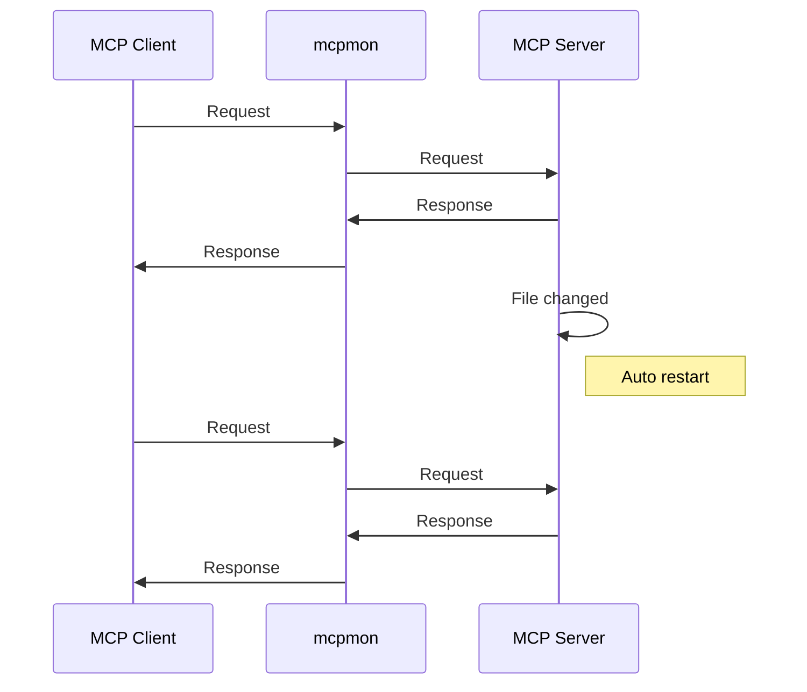

# mcpmon

[](https://nodejs.org/)
[](https://opensource.org/licenses/MIT)
[](./tests/)
[](https://prettier.io/)

**Hot-reload monitor for MCP servers - like nodemon but for Model Context Protocol**

Make changes to your MCP server code and see them instantly without restarting your MCP client. Just like nodemon automatically restarts Node.js applications, mcpmon automatically restarts MCP servers.

## What it is

mcpmon is a **transparent proxy** that sits between your MCP client (Claude Code, Claude Desktop, MCP Inspector, etc.) and your MCP server. When you modify your server code, mcpmon automatically restarts the server while keeping your client connected.

**Key benefits:**

- **Like nodemon, but for MCP** - Simple command-line interface you already know
- **Zero configuration** - Just wrap your server command with mcpmon
- **Non-disruptive development** - Your MCP client stays connected while your server reloads
- **Zero message loss** - Requests are buffered during server restart
- **Universal compatibility** - Works with any MCP server (Node.js, Python, Deno, etc.)
- **Library support** - Import as a dependency for custom monitoring solutions

## Quick Start

1. **Install globally**:
   ```bash
   npm install -g mcpmon
   ```

2. **Use with your MCP server**:
   ```bash
   # Instead of: node server.js
   mcpmon node server.js

   # Instead of: python server.py  
   mcpmon python server.py

   # Instead of: deno run --allow-all server.ts
   mcpmon deno run --allow-all server.ts
   ```

3. **Use with MCP clients**:
   ```bash
   # MCP Inspector
   npx @modelcontextprotocol/inspector mcpmon node server.js

   # For existing Claude Code/Desktop servers, use setup:
   mcpmon setup my-server
   ```

   Setup automatically configures your existing MCP servers for hot-reload! ✨

That's it! Your MCP server now has hot-reload enabled. Edit your server code and changes apply instantly.

## Usage Examples

### Basic Usage

```bash
# Node.js server
mcpmon node server.js

# Python server
mcpmon python -m mcp_server

# Python with args
mcpmon python server.py --port 3000

# Deno server
mcpmon deno run --allow-all server.ts

# With debugging
mcpmon node --inspect server.js
```

### With MCP Inspector

```bash
# Direct command
npx @modelcontextprotocol/inspector mcpmon node server.js

# With environment variables
API_KEY=your-key npx @modelcontextprotocol/inspector mcpmon node server.js
```

### With Claude Code or Claude Desktop

**Easiest way:** Use the automatic setup command for existing servers:

```bash
# Setup hot-reload for an existing server
mcpmon setup my-server

# Setup all stdio servers for hot-reload
mcpmon setup --all

# List available servers
mcpmon setup --list

# Restore original config if needed
mcpmon setup --restore
```

The setup command automatically:
- Backs up your original configuration
- Detects and uses modern Node.js versions for compatibility
- Wraps your server command with mcpmon 
- Preserves all environment variables and arguments
- Enables hot-reload instantly
- Safe to run multiple times

### 🔥 Claude Desktop Hot-Reload Tips

After setting up hot-reload:

- **Code changes**: Your server automatically restarts - no action needed!
- **Schema changes** (new tools/resources): Toggle the MCP server off/on in Claude Desktop settings
  - Go to Claude Desktop Settings → Features → Model Context Protocol
  - Toggle your server off, then back on
  - **No restart needed** - just the toggle!
- **Config changes**: Restart Claude Desktop only if you modify the configuration file directly

> **Pro tip**: For the best development experience, make code changes first, then schema changes. Claude Desktop will pick up tool calls from the latest hot-reloaded code even after schema updates!

**Manual configuration:** You can also manually update your config:

**Claude Code** (`~/.claude_code_config`):
```json
{
  "mcpServers": {
    "my-server": {
      "command": "mcpmon",
      "args": ["node", "server.js"],
      "env": {
        "API_KEY": "your-key"
      }
    }
  }
}
```

**Claude Desktop** (`~/Library/Application Support/Claude/claude_desktop_config.json`):
```json
{
  "mcpServers": {
    "my-server": {
      "command": "/Users/username/.nvm/versions/node/v22.15.0/bin/node",
      "args": ["/usr/local/bin/mcpmon", "python", "server.py"],
      "env": {
        "PYTHONPATH": "/path/to/your/modules"
      }
    }
  }
}
```

> **Note**: The setup command automatically detects your latest Node.js version and mcpmon path. The above shows what the generated config looks like - you rarely need to write this manually!

## Configuration

mcpmon works out of the box with **zero configuration**. It automatically detects your server file and starts watching for changes.

To watch additional files:
```bash
# Watch multiple files
MCPMON_WATCH="server.js,config.json" mcpmon node server.js
```

That's it! mcpmon is designed to work with zero configuration.

### Environment Variables

- `MCPMON_WATCH` - Override files/directories to watch (comma-separated)
- `MCPMON_DELAY` - Restart delay in milliseconds (default: 1000)
- `MCPMON_VERBOSE` - Enable verbose logging
- `MCPMON_EXTENSIONS_DIR` - Extension data directory (default: ./mcpmon-data)
- `MAX_MCP_OUTPUT_TOKENS` - Large response threshold in tokens (default: 6250 tokens ≈ 25KB)

## Extensions

mcpmon supports a powerful extension system that can enhance functionality without modifying core code. Extensions can intercept messages, add new tools, handle large responses, and more.

### List Available Extensions

```bash
# See all available extensions
mcpmon --list-extensions
```

### Enable/Disable Extensions

```bash
# Enable specific extension
mcpmon --enable-extension large-response-handler node server.js

# Disable specific extension  
mcpmon --disable-extension request-logger node server.js

# Enable multiple extensions
mcpmon --enable-extension ext1 --enable-extension ext2 node server.js
```

### Extension Configuration

```bash
# Set extension data directory
mcpmon --extensions-data-dir ./my-data node server.js

# Pass JSON configuration to extensions
mcpmon --extension-config '{"threshold":25000,"format":"parquet"}' node server.js

# Combine extension options
mcpmon --enable-extension large-response-handler \
       --extensions-data-dir ./data \
       --extension-config '{"threshold":10000}' \
       node server.js
```

### Built-in Extensions

**Large Response Handler** (`large-response-handler`)
- Automatically handles MCP tool responses that exceed token limits (default: 25KB or MAX_MCP_OUTPUT_TOKENS env var)
- Persists large data to disk and returns metadata instead
- Generates JSON schemas and creates queryable DuckDB databases
- Adds `mcpmon_analyze-with-duckdb` and `mcpmon_list-saved-datasets` tools

```bash
# Enable large response handling
mcpmon --enable-extension large-response-handler node server.js

# Configure response size threshold (in bytes)
mcpmon --enable-extension large-response-handler \
       --extension-config '{"threshold":20000}' \
       node server.js
```

### Extension Examples

```bash
# Development with large data processing
mcpmon --enable-extension large-response-handler \
       --extensions-data-dir ./session-data \
       python data_server.py

# Multiple extensions for monitoring
mcpmon --enable-extension request-logger \
       --enable-extension large-response-handler \
       --extension-config '{"logLevel":"debug","threshold":15000}' \
       node server.js

# Production monitoring
mcpmon --enable-extension metrics \
       --extensions-data-dir /var/log/mcpmon \
       --extension-config '{"metricsPort":9090}' \
       node server.js
```

### Creating Custom Extensions

Extensions are TypeScript/JavaScript modules that implement the Extension interface:

```typescript
// my-extension/index.ts
export class MyExtension implements Extension {
  readonly id = 'my-extension';
  readonly name = 'My Custom Extension';
  readonly version = '1.0.0';
  readonly defaultEnabled = false;
  
  async initialize(context: ExtensionContext): Promise<void> {
    // Setup extension with hooks, tools, etc.
    context.hooks.beforeStdinForward = this.interceptRequest;
    context.hooks.getAdditionalTools = this.getTools;
  }
  
  async shutdown(): Promise<void> {
    // Cleanup resources
  }
}
```

Extensions can:
- **Intercept messages** before forwarding to server or after receiving responses
- **Add new MCP tools** that appear alongside server tools
- **Handle large responses** by persisting to disk and returning metadata
- **Monitor and log** all request/response activity
- **Transform data** on the fly
- **Add authentication** or rate limiting

## Docker Container Management

mcpmon provides advanced Docker container management features that enable safe hot-reload for containerized MCP servers while preventing orphaned containers and resource leaks.

### Session-based Container Tracking

Each mcpmon instance creates a unique session ID and tracks only the Docker containers it manages:

- **Unique Session ID**: Every mcpmon instance generates a UUID-based session identifier
- **Container Isolation**: Each session only manages its own containers, preventing interference between multiple mcpmon instances
- **Safe Concurrent Usage**: Multiple mcpmon instances can run simultaneously without affecting each other's containers

### Container Labeling Scheme

mcpmon automatically injects Docker labels into `docker run` commands to track container ownership and lifecycle:

```bash
# Labels automatically added by mcpmon:
--label mcpmon.managed=true           # Identifies mcpmon-managed containers
--label mcpmon.session=<uuid>         # Unique session identifier  
--label mcpmon.pid=<pid>              # mcpmon process ID
--label mcpmon.started=<timestamp>    # Container start time
```

**Example usage:**
```bash
# Original command
mcpmon docker run -d my-mcp-server:latest

# Actual command executed (labels injected automatically)
docker run -d \
  --label mcpmon.managed=true \
  --label mcpmon.session=a1b2c3d4-e5f6-7890-abcd-ef1234567890 \
  --label mcpmon.pid=12345 \
  --label mcpmon.started=1672531200000 \
  my-mcp-server:latest
```

### Inspecting Container Labels

View mcpmon labels on running containers:

```bash
# Inspect specific container
docker inspect <container-id> | grep mcpmon

# Find all mcpmon-managed containers
docker ps --filter label=mcpmon.managed=true

# Show detailed label information
docker ps --filter label=mcpmon.managed=true --format "table {{.ID}}\t{{.Names}}\t{{.Label \"mcpmon.session\"}}\t{{.Label \"mcpmon.pid\"}}"
```

### Orphan Recovery Mechanism

mcpmon includes built-in orphan detection and cleanup to handle crashed mcpmon instances:

**Automatic Detection:**
- Containers are considered orphaned when their associated mcpmon process (PID) no longer exists
- Orphans are detected by checking if the `mcpmon.pid` label references a dead process
- Containers without PID labels are also considered orphaned

**Manual Cleanup:**
```bash
# Scan for orphaned containers and prompt for cleanup
mcpmon --cleanup

# Force cleanup without confirmation
mcpmon --cleanup --force

# Verbose cleanup with detailed logging
mcpmon --cleanup --verbose --force
```

### Troubleshooting

**Manual Container Inspection:**
```bash
# Check all mcpmon-managed containers
docker ps -a --filter label=mcpmon.managed=true

# Inspect specific container labels
docker inspect <container-id> --format='{{range $key, $value := .Config.Labels}}{{if eq $key "mcpmon.session"}}Session: {{$value}}{{end}}{{if eq $key "mcpmon.pid"}}PID: {{$value}}{{end}}{{if eq $key "mcpmon.started"}}Started: {{$value}}{{end}}{{end}}'

# Find containers for specific session
docker ps --filter label=mcpmon.session=<session-id>
```

**Finding Orphaned Containers:**
```bash
# List all mcpmon containers with process status
docker ps --filter label=mcpmon.managed=true --format "table {{.ID}}\t{{.Names}}\t{{.Label \"mcpmon.pid\"}}\t{{.Status}}"

# Check if mcpmon process is still running
ps aux | grep mcpmon | grep <pid>
```

**Manual Cleanup Commands:**
```bash
# Stop specific orphaned container
docker stop <container-id>

# Force kill if stop fails
docker kill <container-id>

# Remove stopped containers
docker container prune

# Stop all mcpmon containers (emergency cleanup)
docker stop $(docker ps -q --filter label=mcpmon.managed=true)
```

**Common Issues:**

1. **Container won't stop**: Try `docker kill` instead of `docker stop`
2. **Permission errors**: Ensure Docker daemon is running and user has permissions
3. **Stale containers**: Use `mcpmon --cleanup --force` to remove orphaned containers
4. **Process still running**: Check if mcpmon process crashed with `ps aux | grep mcpmon`

### Safety Improvements

**Session Isolation:**
- Each mcpmon instance only manages containers from its own session
- Prevents accidental termination of containers managed by other mcpmon instances
- Session ID is included in all container operations for verification

**Graceful Shutdown:**
- Containers are stopped gracefully with 10-second timeout before force kill
- mcpmon tracks container lifecycle and cleans up on exit
- Failed stop operations automatically fallback to force kill

**Migration Notes:**
- **Behavior Change**: mcpmon now uses session-based tracking instead of image-based management
- **Improved Safety**: No longer affects containers not started by the same mcpmon instance
- **Backward Compatibility**: Existing containers without mcpmon labels are ignored
- **Cleanup Required**: Run `mcpmon --cleanup` to remove containers from previous versions

### Usage Examples

```bash
# Docker container with hot-reload
mcpmon docker run -d -p 3000:3000 my-mcp-server:latest

# Docker Compose services
mcpmon docker compose up my-service

# Container with environment variables
mcpmon docker run -d -e API_KEY=secret my-server:latest

# Cleanup orphaned containers after crashes
mcpmon --cleanup --force

# Monitor cleanup process
mcpmon --cleanup --verbose
```

## How It Works

mcpmon acts as a transparent proxy between your MCP client and server, providing automatic hot-reload capabilities:



**The magic:** Your MCP client stays connected while your server reloads. No need to reconnect Claude Code or restart MCP Inspector!

| Feature | Without mcpmon | With mcpmon |
|---------|---------|---------|
| **File changes** | Manual restart required | Automatic restart |
| **Client connection** | Must reconnect | Stays connected |
| **Lost messages** | Possible | Never (buffered) |
| **Setup complexity** | Manual config changes | Just add `mcpmon` |

## Need Help?

**Enable verbose logging** to see what's happening:
```bash
MCPMON_VERBOSE=1 mcpmon node server.js
```

**Common issues:**
- **"ReadableStream is not defined"?** mcpmon requires Node.js 16+. Use `mcpmon setup` to auto-detect modern Node.js versions
- **Server won't start?** Check the error messages for missing dependencies
- **No hot reload?** Verify your server file is being detected in the logs
- **Schema changes not visible?** Toggle your MCP server off/on in Claude Desktop settings
- **Need help?** See our [Troubleshooting Guide](TROUBLESHOOTING.md)

## Development

```bash
# Run tests (includes clean and build)
npm test

# Development mode
npm run dev
```

See [Contributing Guide](CONTRIBUTING.md) for more details.

## Installation

**Requirements:** [Node.js](https://nodejs.org/) 16+ (automatically detected by setup command)

```bash
# Install globally (recommended)
npm install -g mcpmon

# Or use without installing
npx mcpmon node server.js
```

## Contributing

We welcome contributions! See [Contributing Guide](CONTRIBUTING.md) for details.

## Documentation

- [API Documentation](docs/api.md) - Library usage and advanced features
- [Architecture Guide](docs/architecture.md) - How mcpmon works internally
- [Testing Guide](docs/testing.md) - Test architecture and patterns
- [Troubleshooting Guide](TROUBLESHOOTING.md) - Common issues and solutions
- [Contributing Guide](CONTRIBUTING.md) - How to contribute
- [Changelog](CHANGELOG.md) - Version history and changes

## License

MIT License - see [LICENSE](LICENSE) file for details.

---

**Like nodemon? You'll love mcpmon.** Simple, fast, and reliable hot-reload for MCP development.