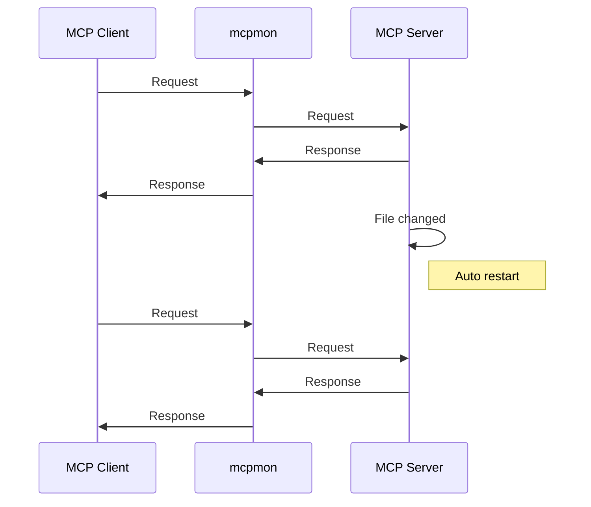

# mcpmon

[](https://nodejs.org/)
[](https://opensource.org/licenses/MIT)
[](./tests/)
[](https://prettier.io/)

**Hot-reload monitor for MCP servers - like nodemon but for Model Context Protocol**

Make changes to your MCP server code and see them instantly without restarting your MCP client. Just like nodemon automatically restarts Node.js applications, mcpmon automatically restarts MCP servers.

## What it is

mcpmon is a **transparent proxy** that sits between your MCP client (Claude Code, Claude Desktop, MCP Inspector, etc.) and your MCP server. When you modify your server code, mcpmon automatically restarts the server while keeping your client connected.

**Key benefits:**

- **Like nodemon, but for MCP** - Simple command-line interface you already know
- **Zero configuration** - Just wrap your server command with mcpmon
- **Non-disruptive development** - Your MCP client stays connected while your server reloads
- **Zero message loss** - Requests are buffered during server restart
- **Universal compatibility** - Works with any MCP server (Node.js, Python, Deno, etc.)
- **Library support** - Import as a dependency for custom monitoring solutions

## Quick Start

1. **Install globally**:
   ```bash
   npm install -g mcpmon
   ```

2. **Use with your MCP server**:
   ```bash
   # Instead of: node server.js
   mcpmon node server.js

   # Instead of: python server.py  
   mcpmon python server.py

   # Instead of: deno run --allow-all server.ts
   mcpmon deno run --allow-all server.ts
   ```

3. **Use with MCP clients**:
   ```bash
   # MCP Inspector
   npx @modelcontextprotocol/inspector mcpmon node server.js

   # For existing Claude Code/Desktop servers, use setup:
   mcpmon setup my-server
   ```

   Setup automatically configures your existing MCP servers for hot-reload! ✨

That's it! Your MCP server now has hot-reload enabled. Edit your server code and changes apply instantly.

## Usage Examples

### Basic Usage

```bash
# Node.js server
mcpmon node server.js

# Python server
mcpmon python -m mcp_server

# Python with args
mcpmon python server.py --port 3000

# Deno server
mcpmon deno run --allow-all server.ts

# With debugging
mcpmon node --inspect server.js
```

### With MCP Inspector

```bash
# Direct command
npx @modelcontextprotocol/inspector mcpmon node server.js

# With environment variables
API_KEY=your-key npx @modelcontextprotocol/inspector mcpmon node server.js
```

### With Claude Code or Claude Desktop

**Easiest way:** Use the automatic setup command for existing servers:

```bash
# Setup hot-reload for an existing server
mcpmon setup my-server

# Setup all stdio servers for hot-reload
mcpmon setup --all

# List available servers
mcpmon setup --list

# Restore original config if needed
mcpmon setup --restore
```

The setup command automatically:
- ✅ **Backs up** your original configuration
- ✅ **Detects** and uses modern Node.js versions for compatibility
- ✅ **Wraps** your server command with mcpmon 
- ✅ **Preserves** all environment variables and arguments
- ✅ **Enables** hot-reload instantly
- ✅ **Idempotent** - safe to run multiple times

### 🔥 Claude Desktop Hot-Reload Tips

After setting up hot-reload:

- **Code changes**: Your server automatically restarts - no action needed!
- **Schema changes** (new tools/resources): Toggle the MCP server off/on in Claude Desktop settings
  - Go to Claude Desktop Settings → Features → Model Context Protocol
  - Toggle your server off, then back on
  - **No restart needed** - just the toggle!
- **Config changes**: Restart Claude Desktop only if you modify the configuration file directly

> **Pro tip**: For the best development experience, make code changes first, then schema changes. Claude Desktop will pick up tool calls from the latest hot-reloaded code even after schema updates!

**Manual configuration:** You can also manually update your config:

**Claude Code** (`~/.claude_code_config`):
```json
{
  "mcpServers": {
    "my-server": {
      "command": "mcpmon",
      "args": ["node", "server.js"],
      "env": {
        "API_KEY": "your-key"
      }
    }
  }
}
```

**Claude Desktop** (`~/Library/Application Support/Claude/claude_desktop_config.json`):
```json
{
  "mcpServers": {
    "my-server": {
      "command": "/Users/username/.nvm/versions/node/v22.15.0/bin/node",
      "args": ["/usr/local/bin/mcpmon", "python", "server.py"],
      "env": {
        "PYTHONPATH": "/path/to/your/modules"
      }
    }
  }
}
```

> **Note**: The setup command automatically detects your latest Node.js version and mcpmon path. The above shows what the generated config looks like - you rarely need to write this manually!

## Configuration

mcpmon works out of the box with **zero configuration**. It automatically detects your server file and starts watching for changes.

To watch additional files:
```bash
# Watch multiple files
MCPMON_WATCH="server.js,config.json" mcpmon node server.js
```

That's it! mcpmon is designed to work with zero configuration.

### Environment Variables

- `MCPMON_WATCH` - Override files/directories to watch (comma-separated)
- `MCPMON_DELAY` - Restart delay in milliseconds (default: 1000)
- `MCPMON_VERBOSE` - Enable verbose logging

## How It Works

mcpmon acts as a transparent proxy between your MCP client and server, providing automatic hot-reload capabilities:



**The magic:** Your MCP client stays connected while your server reloads. No need to reconnect Claude Code or restart MCP Inspector!

| Feature | Without mcpmon | With mcpmon |
|---------|---------|---------|
| **File changes** | Manual restart required | Automatic restart |
| **Client connection** | Must reconnect | Stays connected |
| **Lost messages** | Possible | Never (buffered) |
| **Setup complexity** | Manual config changes | Just add `mcpmon` |

## Need Help?

**Enable verbose logging** to see what's happening:
```bash
MCPMON_VERBOSE=1 mcpmon node server.js
```

**Common issues:**
- **"ReadableStream is not defined"?** mcpmon requires Node.js 16+. Use `mcpmon setup` to auto-detect modern Node.js versions
- **Server won't start?** Check the error messages for missing dependencies
- **No hot reload?** Verify your server file is being detected in the logs
- **Schema changes not visible?** Toggle your MCP server off/on in Claude Desktop settings
- **Need help?** See our [Troubleshooting Guide](TROUBLESHOOTING.md)

## Development

```bash
# Run tests (includes clean and build)
npm test

# Development mode
npm run dev
```

See [Contributing Guide](CONTRIBUTING.md) for more details.

## Installation

**Requirements:** [Node.js](https://nodejs.org/) 16+ (automatically detected by setup command)

```bash
# Install globally (recommended)
npm install -g mcpmon

# Or use without installing
npx mcpmon node server.js
```

## Contributing

We welcome contributions! See [Contributing Guide](CONTRIBUTING.md) for details.

## Documentation

- [API Documentation](docs/api.md) - Library usage and advanced features
- [Architecture Guide](docs/architecture.md) - How mcpmon works internally
- [Testing Guide](docs/testing.md) - Test architecture and patterns
- [Troubleshooting Guide](TROUBLESHOOTING.md) - Common issues and solutions
- [Contributing Guide](CONTRIBUTING.md) - How to contribute
- [Changelog](CHANGELOG.md) - Version history and changes

## License

MIT License - see [LICENSE](LICENSE) file for details.

---

**Like nodemon? You'll love mcpmon.** Simple, fast, and reliable hot-reload for MCP development.