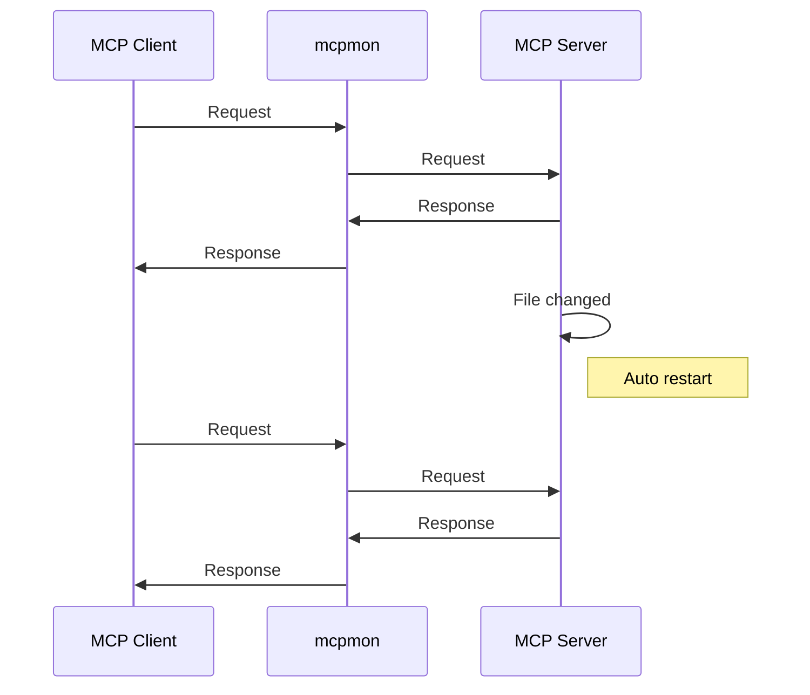

# mcpmon

[](https://nodejs.org/)
[](https://opensource.org/licenses/MIT)
[](./tests/)
[](https://prettier.io/)

**Hot-reload monitor for MCP servers - like nodemon but for Model Context Protocol**

mcpmon is a transparent proxy that automatically restarts your MCP server when files change, while keeping your MCP client connected. No more manual restarts or reconnections during development.

## Quick Start

1. **Install globally**:
   ```bash
   npm install -g mcpmon
   ```

2. **Use with your MCP server** (just add `mcpmon` before your command):
   ```bash
   # Instead of: node server.js
   mcpmon node server.js

   # Instead of: python server.py  
   mcpmon python server.py

   # Instead of: deno run --allow-all server.ts
   mcpmon deno run --allow-all server.ts
   ```

3. **Use with MCP clients**:
   ```bash
   # MCP Inspector
   npx @modelcontextprotocol/inspector mcpmon node server.js

   # For existing Claude Code/Desktop servers, use setup:
   mcpmon setup my-server
   ```

**That's it!** Your MCP server now has hot-reload enabled. Edit your server code and changes apply instantly.

### Setup for Claude Desktop/Code

The easiest way is the automatic setup command:

```bash
# Setup hot-reload for an existing server
mcpmon setup my-server

# Setup all stdio servers for hot-reload  
mcpmon setup --all

# List available servers
mcpmon setup --list
```

The setup command automatically backs up your original configuration and wraps your server command with mcpmon for instant hot-reload.

## Basic Commands

```bash
# Enable verbose logging to see what's happening
mcpmon --verbose node server.js

# Set custom restart delay (milliseconds)
mcpmon --delay 1000 node server.js

# Override which files to watch
mcpmon --watch "src/,config/" node server.js

# Show version and help
mcpmon --version
mcpmon --help
```

## Essential Environment Variables

```bash
# Override files/directories to watch (comma-separated)
MCPMON_WATCH="src/,config/,*.json" mcpmon node server.js

# Enable verbose logging
MCPMON_VERBOSE=1 mcpmon node server.js

# Set restart delay in milliseconds  
MCPMON_DELAY=2000 mcpmon node server.js
```

## Popular MCP Server Examples

**Zen MCP Server** - AI orchestration for collaborative coding:
```bash
# Multi-AI model orchestration (OpenAI, Gemini, OpenRouter)
mcpmon pipx run --spec git+https://github.com/BeehiveInnovations/zen-mcp-server.git zen-mcp-server
```

**Context7** - Real-time documentation fetching:
```bash
# Up-to-date docs with large response handling for big documentation
mcpmon --enable-extension large-response-handler npx -y @upstash/context7-mcp
```

**Browser Tools MCP** - Browser monitoring and auditing:
```bash
# Browser debugging with large response handling for audit data
# Requires: npx @agentdeskai/browser-tools-server (run first)
mcpmon --enable-extension large-response-handler npx @agentdeskai/browser-tools-mcp@latest
```

**Serena** - Coding agent toolkit:
```bash
# Semantic code analysis and autonomous coding
mcpmon uvx --from git+https://github.com/oraios/serena serena-mcp-server
```

> **💡 Why mcpmon?** All these servers get the `mcpmon_reload-server` tool for manual restarts, proxy stability during long operations, and optional extension benefits like large response handling—without any file watching needed!

## How It Works

mcpmon acts as a transparent proxy between your MCP client and server:



**The magic:** Your MCP client stays connected while your server reloads. No need to reconnect Claude Code or restart MCP Inspector!

| Feature | Without mcpmon | With mcpmon |
|---------|---------|---------|
| **File changes** | Manual restart required | Automatic restart |
| **Client connection** | Must reconnect | Stays connected |
| **Lost messages** | Possible | Never (buffered) |
| **Setup complexity** | Manual config changes | Just add `mcpmon` |

## Need Help?

**Enable verbose logging** to see what's happening:
```bash
MCPMON_VERBOSE=1 mcpmon node server.js
```

**Common issues:**
- **"ReadableStream is not defined"?** mcpmon requires Node.js 16+. Use `mcpmon setup` to auto-detect modern Node.js versions
- **Server won't start?** Check the error messages for missing dependencies
- **No hot reload?** Verify your server file is being detected in the logs
- **Schema changes not visible?** Toggle your MCP server off/on in Claude Desktop settings

## Documentation

### Getting Started
- [Command-Line Interface](docs/cli.md) - Complete CLI reference and options
- [Configuration Guide](docs/configuration.md) - Environment variables and config files  
- [Examples and Use Cases](docs/examples.md) - Practical examples and integration patterns

### Advanced Features
- [Extension Development Guide](docs/extension-development.md) - Build custom extensions
- [Docker Container Management](docs/docker.md) - Container tracking and troubleshooting
- [API Documentation](docs/api.md) - Library usage and programmatic API

### Project Information  
- [Architecture Guide](docs/architecture.md) - How mcpmon works internally
- [Testing Guide](docs/testing.md) - Test architecture and patterns
- [Troubleshooting Guide](TROUBLESHOOTING.md) - Common issues and solutions
- [Contributing Guide](CONTRIBUTING.md) - How to contribute
- [Changelog](CHANGELOG.md) - Version history and changes

## Installation

**Requirements:** [Node.js](https://nodejs.org/) 16+ (automatically detected by setup command)

```bash
# Install globally (recommended)
npm install -g mcpmon

# Or use without installing
npx mcpmon node server.js
```

## Contributing

We welcome contributions! See [Contributing Guide](CONTRIBUTING.md) for details.

## License

MIT License - see [LICENSE](LICENSE) file for details.

---

**Like nodemon? You'll love mcpmon.** Simple, fast, and reliable hot-reload for MCP development.