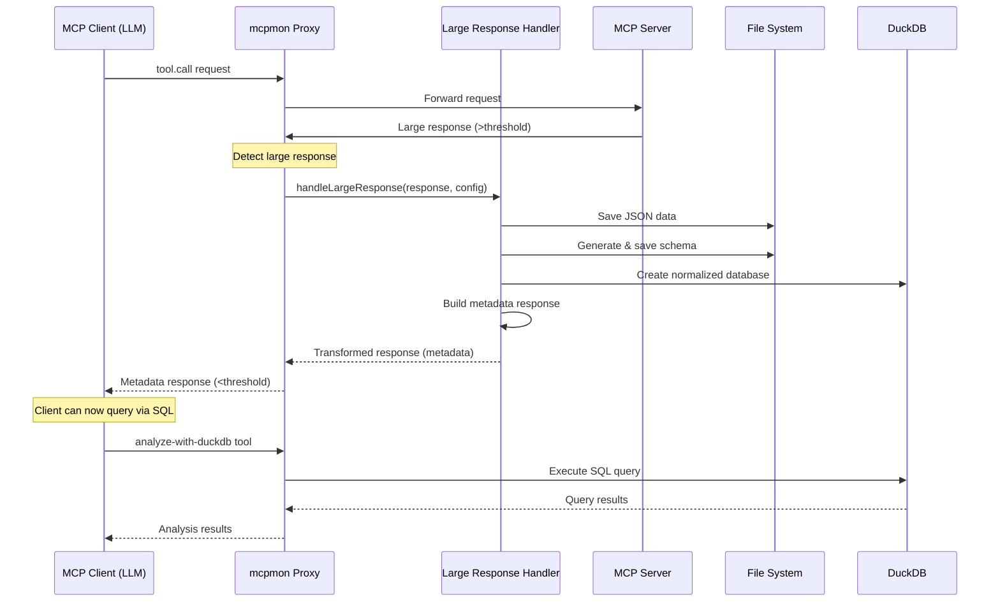

# Large Response Handler for mcpmon

## Overview

This document describes the integration of a large response handling pattern into mcpmon, based on the sophisticated approach used by the ChannelApe MCP server. This feature would automatically detect and handle MCP tool responses that exceed configurable size thresholds, preventing token limit errors in LLMs.

## Problem Statement

MCP servers often return large datasets that can:
- Exceed MCP protocol token limits (~25,000 tokens)
- Overwhelm LLM context windows  
- Cause "token limit exceeded" errors
- Make data analysis inefficient without proper indexing

## Proposed Solution

Integrate a proxy-level large response handler into mcpmon that:

1. **Intercepts** tool call responses before forwarding to the client
2. **Detects** responses exceeding configurable thresholds
3. **Persists** large data to filesystem with session organization
4. **Generates** schemas and creates normalized databases
5. **Transforms** the response to return metadata instead of raw data
6. **Provides** SQL query capabilities via DuckDB integration

## Architecture



## Configuration

### Server-Level Configuration

```typescript
// In mcpmon configuration
interface MCPProxyConfig {
  // Existing config...
  largeResponseHandler?: {
    enabled: boolean;                    // Feature flag (default: false)
    threshold: number;                   // Size threshold in KB (default: 25)
    tokenThreshold?: number;             // Token count threshold (default: 20000)
    dataDir?: string;                    // Storage directory (default: /tmp/.mcpmon)
    enableDuckDB?: boolean;              // Enable DuckDB integration (default: true)
    enableSchemaGeneration?: boolean;    // Generate JSON schemas (default: true)
    cacheTTL?: number;                   // Cache TTL in ms (default: 300000)
    
    // Per-tool overrides
    toolOverrides?: {
      [toolName: string]: {
        threshold?: number;              // Custom threshold for specific tools
        alwaysPersist?: boolean;         // Always persist regardless of size
        transformerPath?: string;        // Custom transformer module
      };
    };
  };
}
```

### Usage Example

```bash
# Via environment variables
MCPMON_LRH_ENABLED=true \
MCPMON_LRH_THRESHOLD=20 \
MCPMON_LRH_DATA_DIR=/var/lib/mcpmon \
mcpmon node my-server.js

# Or in a config file
{
  "largeResponseHandler": {
    "enabled": true,
    "threshold": 25,
    "toolOverrides": {
      "query-orders": {
        "alwaysPersist": true,
        "threshold": 10
      },
      "get-inventory": {
        "threshold": 50
      }
    }
  }
}
```

## Implementation Details

### 1. Response Interception

```typescript
// In proxy.ts - intercept tool responses
private async handleToolResponse(response: any, toolName: string): Promise<any> {
  if (!this.config.largeResponseHandler?.enabled) {
    return response; // Pass through unchanged
  }

  const handler = new LargeResponseHandler(this.config.largeResponseHandler);
  const shouldHandle = await handler.shouldHandleResponse(response, toolName);
  
  if (shouldHandle) {
    return await handler.processLargeResponse(response, toolName, {
      sessionId: this.sessionId,
      originalRequest: this.lastToolRequest
    });
  }
  
  return response;
}
```

### 2. Size Detection

```typescript
class LargeResponseHandler {
  shouldHandleResponse(response: any, toolName: string): boolean {
    const config = this.getConfigForTool(toolName);
    
    // Check if always persist is enabled for this tool
    if (config.alwaysPersist) return true;
    
    // Calculate size and token estimates
    const jsonString = JSON.stringify(response);
    const sizeKB = Buffer.byteLength(jsonString) / 1024;
    const estimatedTokens = jsonString.length / 4; // Rough estimate
    
    return sizeKB > config.threshold || 
           estimatedTokens > (config.tokenThreshold || 20000);
  }
}
```

### 3. Response Transformation

```typescript
interface LargeResponseMetadata {
  status: 'success_file_saved';
  originalTool: string;
  count?: number;
  dataFile: string;
  schemaResource?: string;
  database?: {
    path: string;
    tables: TableInfo[];
    sampleQueries: string[];
  };
  metadata: {
    sizeKB: number;
    estimatedTokens: number;
    timestamp: number;
    sessionId: string;
  };
}
```

### 4. Built-in Analysis Tools

When large response handling is enabled, mcpmon would automatically inject additional tools:

```typescript
// Automatically injected when LRH is enabled
const injectedTools = [
  {
    name: "mcpmon.analyze-with-duckdb",
    description: "Execute SQL queries on persisted datasets",
    inputSchema: {
      type: "object",
      properties: {
        query: { type: "string", description: "SQL query to execute" },
        database: { type: "string", description: "Path to DuckDB file" }
      },
      required: ["query", "database"]
    }
  },
  {
    name: "mcpmon.list-saved-datasets",
    description: "List available persisted datasets",
    inputSchema: {
      type: "object",
      properties: {
        sessionId: { type: "string", description: "Optional session filter" }
      }
    }
  }
];
```

## File Organization

```
/tmp/.mcpmon/                              # Or configured dataDir
└── {sessionId}/                          # Session-based organization
    └── {toolName}/                       # Tool-specific subdirectory
        ├── response-{timestamp}.json     # Raw response data
        ├── schema-{timestamp}.json       # Generated JSON schema
        ├── database-{timestamp}.duckdb   # Normalized database
        └── metadata-{timestamp}.json     # Response metadata
```

## Integration with Existing mcpmon Features

### Hot Reload Compatibility
- Persisted data survives server restarts
- Session IDs remain consistent across reloads
- Database connections are properly closed before restart

### Message Buffering
- Large response handling happens after buffering
- Ensures complete responses before processing

### Multiple Watch Targets
- Configuration can be reloaded without losing persisted data
- Different thresholds for different server instances

## Performance Considerations

### Memory Management
- Stream large responses to disk instead of loading into memory
- Use chunked processing for very large datasets
- Configurable memory limits

### Caching Strategy
- Cache transformed responses for repeated queries
- TTL-based cache expiration
- Session-based cache isolation

### Database Optimization
- Automatic index creation for common query patterns
- Columnar storage via DuckDB for analytical queries
- Compression for reduced disk usage

## Security Considerations

1. **File System Isolation**: Each session gets its own directory
2. **Path Validation**: Prevent directory traversal attacks
3. **Size Limits**: Maximum file size limits to prevent DoS
4. **Cleanup**: Automatic cleanup of old session data
5. **SQL Injection**: Parameterized queries for DuckDB operations

## Migration Path

### Phase 1: Basic Implementation
- Response size detection
- File persistence
- Metadata response transformation

### Phase 2: Schema & Database
- JSON schema generation
- DuckDB integration
- Normalized table creation

### Phase 3: Advanced Features
- Custom transformers
- Streaming support
- Cloud storage backends

### Phase 4: Analytics
- Built-in analysis tools
- Query optimization
- Performance metrics

## Example Use Cases

### 1. E-commerce Order Processing
```typescript
// Server returns 10,000 orders (50MB JSON)
// mcpmon automatically:
// - Saves to disk
// - Creates orders, line_items, fulfillments tables
// - Returns metadata with sample queries

// Client can then:
const result = await callTool("mcpmon.analyze-with-duckdb", {
  query: `
    SELECT status, COUNT(*) as count, SUM(total) as revenue
    FROM orders
    WHERE purchasedAt > '2024-01-01'
    GROUP BY status
  `,
  database: response.database.path
});
```

### 2. Log Analysis
```typescript
// Server returns 1M log entries
// mcpmon creates structured database
// Client can run complex analytics without token limits
```

### 3. Inventory Management
```typescript
// Large inventory snapshots persisted and queryable
// Historical analysis possible across sessions
```

## Dependencies

### Required
- `duckdb`: Analytical database engine
- `quicktype-core`: JSON schema generation

### Optional
- `zod`: Runtime type validation
- `csv-parse`: CSV export capabilities

## Testing Strategy

1. **Unit Tests**: Handler logic, size detection, transformations
2. **Integration Tests**: Full proxy flow with large responses  
3. **Performance Tests**: Memory usage, processing time
4. **Compatibility Tests**: Various MCP server responses

## Documentation

### For Server Developers
- How to optimize responses for LRH
- Custom transformer development
- Best practices for large datasets

### For End Users
- Configuration options
- SQL query examples
- Performance tuning

## Streaming Response Support

### Overview of Streaming Support

The Large Response Handler includes comprehensive streaming support that provides:

- **Automatic buffering of streaming MCP responses**: Detects and handles streaming responses without requiring modifications to MCP clients or servers
- **Progress notifications to keep clients informed**: Sends periodic updates during long-running operations to prevent timeouts
- **Memory-efficient handling of large streams**: Processes data in chunks to handle responses larger than available memory

### Configuration Options for Streaming

The streaming functionality can be configured through the following options:

```typescript
interface StreamingConfig {
  enableStreaming: boolean;           // Enable/disable streaming support (default: true)
  progressUpdateInterval: number;     // Interval for progress notifications in ms (default: 500ms)
  maxBufferSize: number;             // Maximum buffer size in bytes (default: 100MB / 104857600)
  streamingTimeout: number;          // Timeout for streaming operations in ms (default: 5 minutes / 300000)
}
```

### How It Works

The streaming response handler operates transparently:

1. **Detects streaming responses automatically**: Identifies when an MCP server is sending a streaming response based on response headers and content type
2. **Buffers chunks while sending progress notifications**: Accumulates response chunks in memory-efficient buffers while periodically notifying the client of progress
3. **Applies normal LRH processing once complete**: Once the stream is fully received, applies the same large response handling logic (persistence, schema generation, etc.)
4. **No client/server modifications needed**: Works as a transparent proxy layer, requiring no changes to existing MCP implementations

The handler sends progress notifications in the following format:
```json
{
  "type": "streaming_progress",
  "bytesReceived": 52428800,
  "estimatedTotal": 104857600,
  "percentComplete": 50,
  "elapsedMs": 2500
}
```

### Example Configuration

Here's an example of configuring the streaming support in your mcpmon configuration:

```json
{
  "largeResponseHandler": {
    "enabled": true,
    "threshold": 25,
    "enableStreaming": true,
    "progressUpdateInterval": 1000,
    "maxBufferSize": 52428800,
    "streamingTimeout": 600000,
    "toolOverrides": {
      "stream-large-dataset": {
        "alwaysPersist": true,
        "threshold": 10
      }
    }
  }
}
```

Or via environment variables:
```bash
MCPMON_LRH_ENABLE_STREAMING=true \
MCPMON_LRH_PROGRESS_UPDATE_INTERVAL=1000 \
MCPMON_LRH_MAX_BUFFER_SIZE=52428800 \
MCPMON_LRH_STREAMING_TIMEOUT=600000 \
mcpmon node my-server.js
```

### Benefits

The streaming support provides several key advantages:

- **Prevents client timeouts during long operations**: Progress notifications keep the connection alive and inform clients that processing is ongoing
- **Provides real-time feedback on response size**: Clients can track how much data has been received and estimate completion time
- **Handles arbitrarily large streaming responses**: Can process responses that exceed available memory by using chunked processing
- **Transparent to both MCP client and server**: No modifications required to existing MCP implementations - works as a drop-in enhancement

### Implementation Details for Streaming

```typescript
class StreamingResponseHandler {
  async handleStreamingResponse(
    stream: ReadableStream,
    toolName: string,
    config: StreamingConfig
  ): Promise<LargeResponseMetadata> {
    const chunks: Buffer[] = [];
    let totalBytes = 0;
    const startTime = Date.now();
    
    // Set up progress notification timer
    const progressTimer = setInterval(() => {
      this.sendProgressNotification({
        bytesReceived: totalBytes,
        elapsedMs: Date.now() - startTime
      });
    }, config.progressUpdateInterval);
    
    try {
      // Process stream chunks
      for await (const chunk of stream) {
        if (totalBytes + chunk.length > config.maxBufferSize) {
          // Switch to file streaming for very large responses
          return await this.handleLargeStreamToFile(stream, chunks, totalBytes);
        }
        
        chunks.push(chunk);
        totalBytes += chunk.length;
        
        // Check timeout
        if (Date.now() - startTime > config.streamingTimeout) {
          throw new Error('Streaming timeout exceeded');
        }
      }
      
      // Combine chunks and process as normal large response
      const completeResponse = Buffer.concat(chunks);
      return await this.processCompleteResponse(completeResponse, toolName);
      
    } finally {
      clearInterval(progressTimer);
    }
  }
}
```

## Future Enhancements

1. **Incremental Updates**: Append to existing databases
2. **Multi-Format Support**: Parquet, Arrow, CSV exports
3. **Distributed Storage**: S3, GCS, Azure Blob support
4. **Query Federation**: Join data across multiple sessions
5. **Visualization**: Built-in charting for common queries
6. **Advanced Streaming Features**: 
   - Partial response processing
   - Stream transformation pipelines
   - Parallel chunk processing

## Conclusion

This large response handler would make mcpmon a powerful tool for handling production-scale data in MCP servers while maintaining LLM compatibility. It would be transparent to both MCP servers and clients, providing automatic optimization for large datasets.