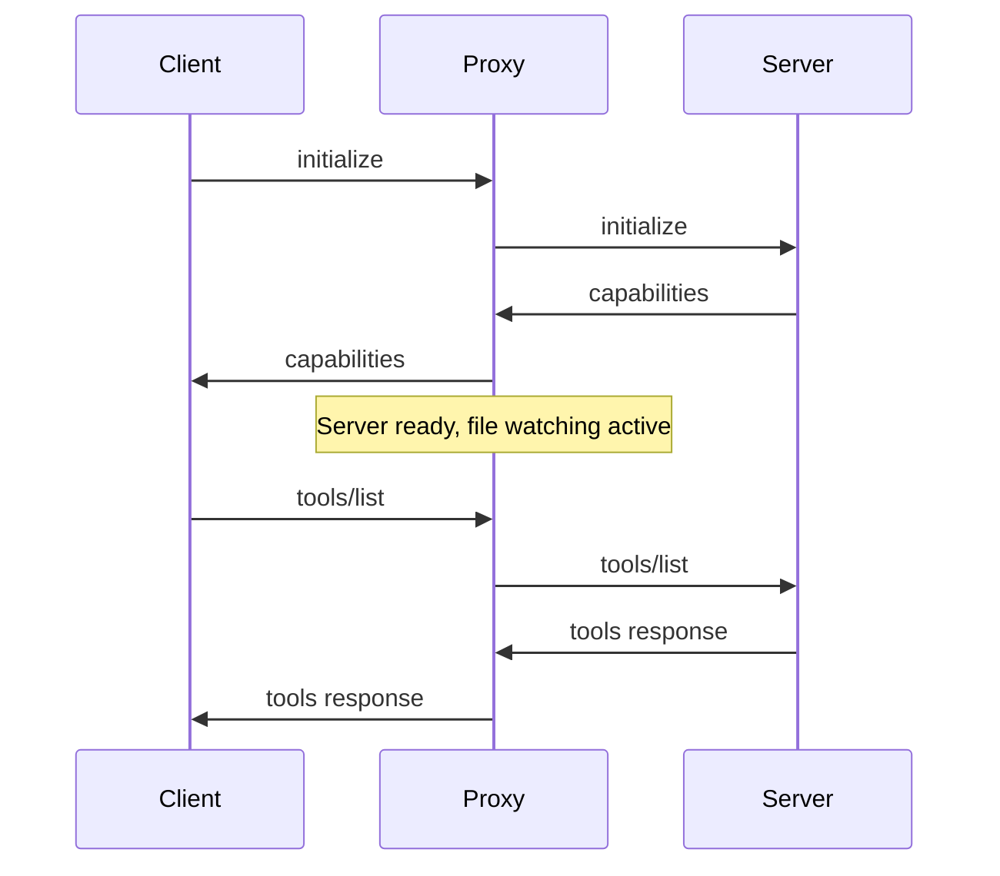

# Architecture Documentation

This document explains the internal architecture and design principles of MCP Hot-Reload.

## Table of Contents

- [Overview](#overview)
- [Core Components](#core-components)
- [Message Flow](#message-flow)
- [File Watching](#file-watching)
- [Process Management](#process-management)
- [Error Handling](#error-handling)
- [Performance Considerations](#performance-considerations)

## Overview

MCP Hot-Reload acts as a transparent proxy between MCP clients (like Claude Desktop) and MCP servers, enabling automatic server restarts when source files change.

```
┌─────────────────┐    JSON-RPC    ┌──────────────────┐    JSON-RPC    ┌─────────────────┐
│                 │ ◄─────────────► │                  │ ◄─────────────► │                 │
│   MCP Client    │                │ Hot-Reload Proxy │                │   MCP Server    │
│ (Claude Desktop)│                │                  │                │                 │
└─────────────────┘                └──────────────────┘                └─────────────────┘
                                             │
                                             │ File System Events
                                             ▼
                                    ┌─────────────────┐
                                    │  File Watcher   │
                                    │   (src/, *.js)  │
                                    └─────────────────┘
```

## Core Components

### 1. Main Proxy (`src/proxy.ts`)

The main proxy implementation uses dependency injection for platform independence:

```typescript
// Dependency injection architecture
interface ProxyDependencies {
  procManager: ProcessManager;
  fs: FileSystem;
  stdin: ReadableStream<Uint8Array>;
  stdout: WritableStream<Uint8Array>;
  stderr: WritableStream<Uint8Array>;
  exit: (code: number) => void;
}

class MCPProxy {
  constructor(
    private deps: ProxyDependencies,
    private config: MCPProxyConfig,
  ) {}

  async start() {
    await this.startServer();
    await this.setupFileWatcher();
    this.setupMessageHandling();
  }
}
```

**Responsibilities:**

- Initialize and coordinate all subsystems
- Handle stdin/stdout communication with MCP client
- Manage the overall lifecycle

### 2. Platform Interfaces (`src/interfaces.ts`)

Abstract interfaces enable cross-platform compatibility:

```typescript
interface ProcessManager {
  spawn(command: string, args: string[], options?: SpawnOptions): ManagedProcess;
}

interface FileSystem {
  watch(paths: string[]): AsyncIterable<FileEvent>;
  readFile(path: string): Promise<string>;
  writeFile(path: string, content: string): Promise<void>;
  exists(path: string): Promise<boolean>;
}
```

**Platform Implementations:**

- **Node.js**: `NodeProcessManager`, `NodeFileSystem`
- **Mock**: `MockProcessManager`, `MockFileSystem` (testing)

### 3. Server Process Manager

Manages the lifecycle of the actual MCP server process:

```typescript
class McpServerProcess {
  private process: ChildProcess | null = null;
  private startupTimeout: number = 30000;
  private shutdownTimeout: number = 10000;

  async start(): Promise<void>;
  async stop(): Promise<void>;
  async restart(): Promise<void>;
}
```

**Key Features:**

- Graceful process startup with timeout
- Signal-based shutdown (SIGTERM → SIGKILL)
- Process health monitoring
- Automatic cleanup on errors

### 4. File Watcher (`FileSystemWatcher`)

Monitors source files for changes using Node.js built-in file system APIs:

```typescript
class FileWatcher {
  private watcher: fs.FSWatcher | null = null;
  private watchPath: string;

  async start() {
    this.watcher = fs.watch(this.watchPath, (eventType, filename) => {
      this.handleFileEvent({ type: eventType, path: filename });
    });
  }
}
```

**Event Types Handled:**

- `create`: New files created
- `modify`: Existing files modified
- `remove`: Files deleted
- `rename`: Files moved/renamed

### 5. Message Buffer

Buffers incoming messages during server restarts to prevent loss:

```typescript
class MessageBuffer {
  private buffer: Array<JsonRpcMessage> = [];
  private isBuffering: boolean = false;

  buffer(message: JsonRpcMessage): void;
  flush(): JsonRpcMessage[];
  clear(): void;
}
```

**Buffering Strategy:**

- Buffer all messages during restart window
- Replay buffered messages after server restart
- Handle initialize requests specially
- Drop messages on buffer overflow

### 6. Debouncer

Prevents rapid successive restarts from file system noise:

```typescript
class Debouncer {
  private timeout: number | null = null;
  private delay: number = 2000;

  trigger(callback: () => void): void {
    if (this.timeout) clearTimeout(this.timeout);
    this.timeout = setTimeout(callback, this.delay);
  }
}
```

## Message Flow

### Normal Operation

```
Client Request → Proxy → Server → Proxy → Client Response
```

1. **Client sends JSON-RPC message** (e.g., `tools/list`)
2. **Proxy forwards to server** via stdin
3. **Server processes and responds** via stdout
4. **Proxy forwards response to client** via stdout

### During Restart

```
Client Request → Buffer → [Server Restart] → Replay → Response
```

1. **File change detected** → Restart triggered
2. **Incoming messages buffered** during restart window
3. **Server stopped gracefully** (SIGTERM)
4. **New server started** with same configuration
5. **Buffered messages replayed** to new server
6. **Normal operation resumed**

### Initialization Sequence



## File Watching

### Watch Strategies

1. **Single File Watching**
   ```bash
   MCP_WATCH_FILE=server.js
   ```
   - Watches specific file for changes
   - Most efficient for simple servers

2. **Directory Watching**
   ```bash
   MCP_WATCH_FILE=src/
   ```
   - Recursively watches directory
   - Captures all file changes in tree

3. **Multiple Path Watching**
   ```bash
   MCP_WATCH_FILE=src/,config/,package.json
   ```
   - Watches multiple files/directories
   - Comma-separated list

### File Event Filtering

Not all file system events trigger restarts:

**Triggers Restart:**

- `.js`, `.ts`, `.py` file modifications
- Configuration file changes
- Package manifest changes (`package.json`, `tsconfig.json`)

**Ignored Events:**

- Temporary files (`.tmp`, `.swp`)
- Hidden files (`.DS_Store`, `.git/`)
- Log files (`.log`)
- Build artifacts (`node_modules/`, `dist/`)

### Debouncing Logic

File system events can be noisy. The debouncer prevents unnecessary restarts:

```typescript
// Example: Multiple rapid saves become single restart
save server.js    → debounce timer starts (2s)
save server.js    → timer resets (2s)  
save config.json  → timer resets (2s)
[2 seconds pass]  → restart triggered
```

## Process Management

### Startup Sequence

1. **Spawn Process**
   ```typescript
   const process = spawn(command, args, {
     stdio: ['pipe', 'pipe', 'inherit'],
     env: environment
   });
   ```

2. **Wait for Ready Signal**
   - Server must respond to `initialize` request
   - Timeout after 30 seconds (configurable)
   - Monitor stderr for error messages

3. **Setup Communication**
   - Pipe client stdin → server stdin
   - Pipe server stdout → client stdout
   - Monitor server stderr for logging

### Shutdown Sequence

1. **Graceful Shutdown** (SIGTERM)
   - Send SIGTERM to server process
   - Wait up to 10 seconds for clean exit
   - Close stdin/stdout pipes

2. **Forced Shutdown** (SIGKILL)
   - If graceful shutdown fails
   - Send SIGKILL to force termination
   - Clean up resources

3. **Cleanup**
   - Close all file descriptors
   - Clear message buffers
   - Reset internal state

### Error Recovery

**Server Crash Detection:**

```typescript
process.status.then((status) => {
  if (!this.isShuttingDown) {
    console.error(`Server crashed with code ${status.code}`);
    this.restart();
  }
});
```

**Automatic Restart on Crash:**

- Detect unexpected process exit
- Log crash reason and exit code
- Automatically restart with exponential backoff
- Maintain client connection during restart

## Error Handling

### Error Categories

1. **Configuration Errors**
   - Invalid command/arguments
   - Missing watch files
   - Invalid environment variables

2. **Runtime Errors**
   - Server startup failures
   - File watching errors
   - JSON-RPC parsing errors

3. **Process Errors**
   - Server crashes
   - Timeout errors
   - Resource exhaustion

### Error Recovery Strategies

**Startup Failures:**

```typescript
async startWithRetry(maxAttempts: number = 3) {
  for (let attempt = 1; attempt <= maxAttempts; attempt++) {
    try {
      await this.start()
      return
    } catch (error) {
      if (attempt === maxAttempts) throw error
      await this.delay(1000 * attempt) // exponential backoff
    }
  }
}
```

**File Watching Failures:**

- Attempt to re-establish file watching
- Fall back to polling if native watching fails
- Continue operation without hot-reload if necessary

**Message Handling Errors:**

- Log malformed JSON-RPC messages
- Continue processing other messages
- Send error responses for invalid requests

## Performance Considerations

### Memory Management

- **Message Buffer Limits**: Prevent unbounded growth during long restarts
- **Process Cleanup**: Ensure zombie processes are reaped
- **File Handle Limits**: Close watchers properly to avoid resource leaks

### Startup Optimization

```typescript
// Parallel initialization
await Promise.all([
  this.serverProcess.start(),
  this.fileWatcher.start(),
  this.setupSignalHandlers(),
]);
```

### Restart Performance

**Fast Restart Optimizations:**

- Keep environment variables cached
- Pre-validate server command before restart
- Use efficient process spawning APIs
- Minimize message buffer operations

**Typical Performance Metrics:**

- Cold startup: 1-3 seconds
- Hot restart: 0.5-1.5 seconds
- File change detection: <100ms
- Message throughput: 1000+ messages/second

### Resource Usage

**Memory Footprint:**

- Base proxy: ~10MB
- Per-server overhead: ~5MB
- Message buffers: ~1MB (typical)

**CPU Usage:**

- Idle: <1% CPU
- During restart: 5-10% CPU (brief spike)
- File watching: <1% CPU

## Security Considerations

### Process Isolation

- Server runs as separate process
- No shared memory between proxy and server
- Server inherits limited environment

### Input Validation

```typescript
function validateJsonRpc(message: unknown): JsonRpcMessage {
  // Validate required fields
  // Sanitize inputs
  // Reject malformed requests
}
```

### File System Access

- Restrict file watching to specified paths
- Validate watch paths exist and are accessible
- Prevent path traversal attacks

### Environment Variable Handling

- Sanitize environment variables
- Prevent injection through MCP_SERVER_ARGS
- Validate command paths

This architecture provides a robust, performant, and secure foundation for hot-reloading MCP servers during development.
